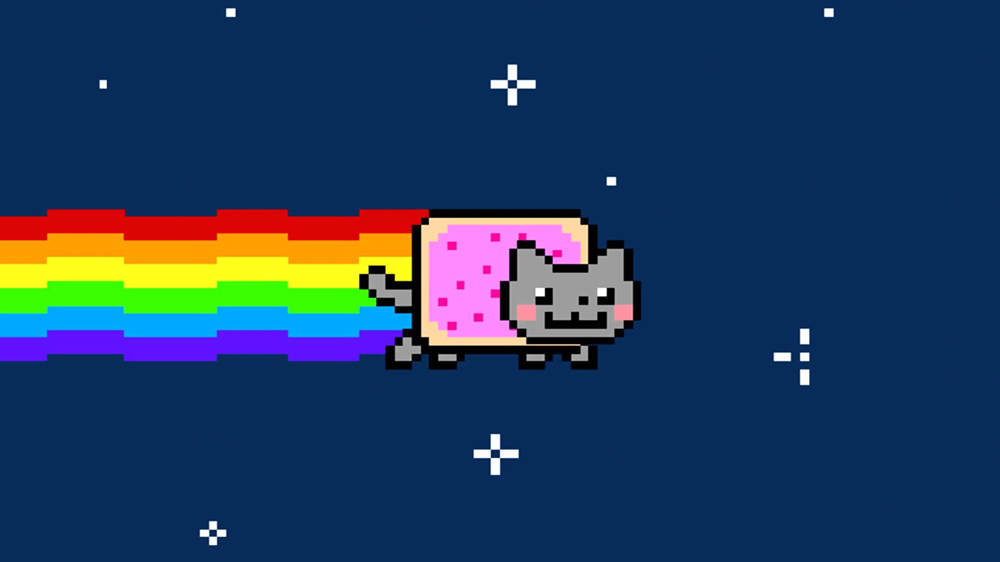

# DeClutter-Challenge-2020
- [Challenge info here](https://dysdoc.github.io/docgen2/index.html) <br>
- [Kaggle Competition here](https://www.kaggle.com/c/declutter20v2) <br>

# Install
```
git clone https://github.com/peppocola/DeClutter-Challenge-2020.git
pip install -r requirements.txt
```
 <br>
